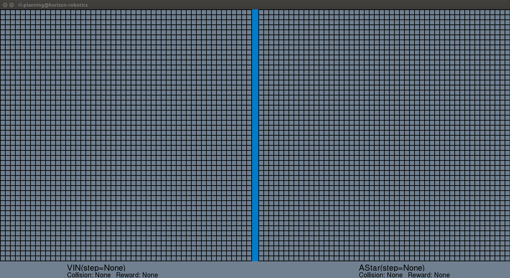
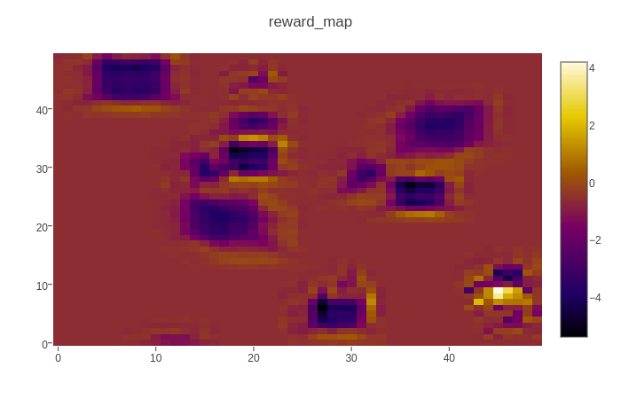
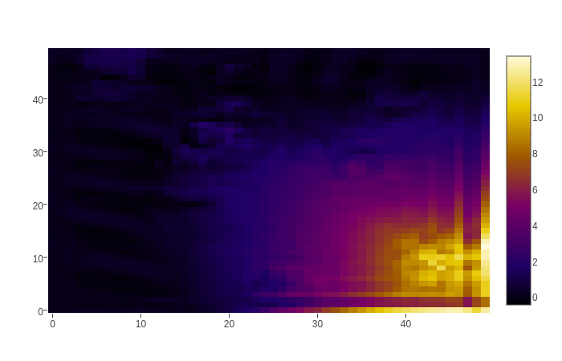
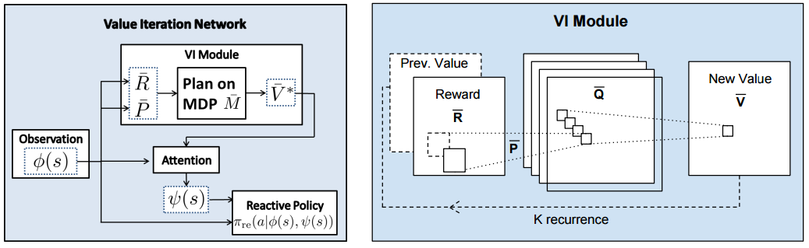

# Learning to plan using dynamic VIN

This is a variation of Value Iteration Network, NIPS 2016 [[arxiv](https://arxiv.org/abs/1602.02867)] .

The main idea building upon original VIN, is to iterate a generated step-wise reward map in the value-iteration loop, for learning to plan in a dynamic scene. This work can be combined with "Video Prediction" techniques, and it is still in progress. Currently, it is trained on the ground-truth state in the simulator.

We use A3C + Curriculum Learning for Rl-training scheme, similar to [[Wu et al, ICLR 2017](https://openreview.net/pdf?id=Hk3mPK5gg)]. Due to the skeleton method of pygame rendering, instead of multiple threads training at the same time, here we use multi-processes generating experience from simulator for multiple agents to learn from.

  

## About the code

The `a3c.py` defines the policy/value network with a share structure (a3c) embedded with a VI Module, as the following,

.

The `agent.py` indicates the single agent and interaction with the environment in reinforcement learning stage, which includes the async with global model and the training methods.

The `thread.py` contains high-level distributed training with `tf.train.ClusterSpec`, and curriculum settings.

The `constants.py` defines all the hyper-parameters.

## How to use

1. Start training: `bash train_scipt.sh`
2. Open tmux for monitoring: `tmux a -t a3c` (you can monitor each thread by switching tmux control pane: `ctrl + b, w`)
3. Open tensorboard: \*\*.\*\*.\*\*.\*\*:15000
4. Stop training: `ctrl + c`

## Requirements

* Tensorflow 1.1
* Pygame
* Numpy

## MISC

I completed this code when I was an intern at [Horizon Robotics](http://www.horizon-robotics.com/index_en.html).
Greatly thanks my mentor Penghong Lin, and Lisen Mu for helpful discussions.

## Useful Resources

* [Value Iteration Networks on arXiv](https://arxiv.org/abs/1602.02867)
* [Aviv Tamar's (author) original implementation in Theano](https://github.com/avivt/VIN)
* [Abhishek Kumar's implementation of VINs in TensorFlow](https://github.com/TheAbhiKumar/tensorflow-value-iteration-networks)
* [Slides](http://technion.ac.il/~danielm/icml_slides/Talk7.pdf)
* [Karpathy's Paper Notes](https://github.com/karpathy/paper-notes/blob/master/vin.md)